<div align="center">

# 🚀 Lead Qualification & CRM Scoring Engine

**An end-to-end, AI-powered multi-workflow automation built in n8n to ingest new CRM contacts, execute conversational surveys over Telegram, calculate weighted qualification scores, and route high-value leads instantly.**

[](https://n8n.io/)
[](https://openai.com/)
[](https://telegram.org/)
[](https://hubspot.com/)
[](https://slack.com/)
[](https://opensource.org/licenses/MIT)

</div>

---

## 📌 System Architecture & Process Flow

This multi-workflow solution is split into two complementary pipelines: **Workflow 1** handles inbound CRM contact triggers, delays, and initiates the Telegram conversational onboarding, while **Workflow 2** processes ongoing conversational replies, executes dynamic scoring, updates HubSpot, and routes alerts to Slack.

```mermaid
graph TD
    subgraph Workflow 1 - Intake & Kickoff
        A[New HubSpot Contact Trigger] --> B[Get Contact Details]
        B --> C[Extract Contact Info]
        C --> D{Has Telegram Chat ID?}
        D -- True --> E[Wait 24 Hours]
        E --> F[Save Lead State in Data Table]
        F --> G[Send Q1 - Intent via Telegram]
    end

    subgraph Workflow 2 - Conversational Survey & Scoring
        H[Incoming Telegram Message] --> I[Parse Telegram Message]
        I --> J[Get Lead State]
        J --> K{Lead Found & Qualifying?}
        K -- False --> L[Mark Non-Responsive]
        K -- True --> M[Process Answer & Advance Step]
        M --> N[Update Lead State]
        N --> O{Qualification Complete?}
        O -- False --> P[Send Next Question]
        O -- True --> Q[Update HubSpot Contact]
        Q --> R[Generate AI Handoff Brief]
        R --> S[Route by Segment]
        S -- Hot --> T[Slack Hot Lead Alert & Telegram Confirm]
        S -- Warm --> U[Slack Warm Queue & Telegram Ack]
        S -- Cold --> V[Telegram Cold Nurture]
    end

```



---

## ⚡ Core Capabilities

* **📥 Automated CRM Intake & Delay:** Automatically catches new contacts from **HubSpot**, extracts their Telegram identifiers, waits 24 hours, and kicks off a personalized outreach sequence.
* **💬 Multi-Step Conversational Survey:** Conducts structured, automated questionnaire flows over **Telegram** to capture critical buyer intent, budget, financing, and timeline criteria.
* **📊 Weighted Dynamic Scoring Engine:** Evaluates free-text responses using rule-based parsing logic to assign a 0–100 qualification score and segment leads into **Hot**, **Warm**, or **Cold** tiers.
* **🚨 Intelligent Routing & Briefings:** Syncs score metrics back to **HubSpot**, generates AI-powered agent handoff briefings via **OpenAI**, and instantly alerts sales teams on **Slack**.

---

## 📂 Repository Structure

```plaintext
📦 n8n-workflows
├── 📄 workflow-lead-intake.json                           # Workflow 1: HubSpot trigger & survey kickoff
├── 📄 workflow-lead-scoring.json                         # Workflow 2: Telegram survey handler & AI scoring
└── 📄 README.md                                          # Documentation & setup guide

```

---

## ⚙️ Installation & Configuration

Follow these steps to deploy both workflows in any self-hosted or cloud-managed n8n instance:

1. **Import Workflow Blueprints**

* Download both JSON workflow files from this repository.
* Import them directly into your n8n workspace.

2. **Configure Credentials & Data Tables**

* **HubSpot:** Link your HubSpot OAuth2/Developer API credentials for contact tracking and custom property updates.
* **Telegram Bot:** Connect your Telegram API credentials for both triggers and message delivery nodes.
* **OpenAI API:** Setup OpenAI credentials for the agent handoff briefing generator.
* **Slack & Data Tables:** Configure your Slack OAuth2 channel integration (e.g., `#leads`) and ensure the `lead_qualification_state` n8n Data Table is configured with matching schema columns.

3. **Activate Pipelines**

* Enable both workflows to allow seamless event passing from HubSpot lead creation through to Telegram conversational tracking.

---

## 🤝 Project Contribution

Contributions, issues, and feature requests are welcome! Feel free to open an issue or submit a pull request via the project repository.

```

```
